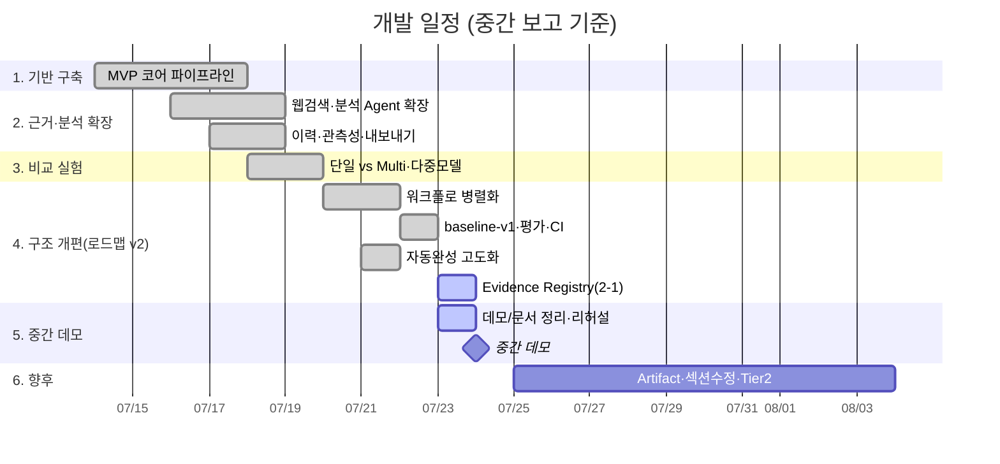

# 03. WBS (작업 분해 구조) · 일정 · 진척 현황

> 중간 보고서의 「개발 계획 / 추진 현황 / 중간 성과」 절에 사용.
> 실제 PR 이력·로드맵 기반. 날짜는 〈학교 일정에 맞춰 조정〉.

---

## 1. 작업 분해 구조 (WBS)

```
1. 기반 구축 (MVP 코어)
   1.1 LLM 연결·provider 추상화·더미 모드
   1.2 Research/PESTEL Agent + 스키마 검증
   1.3 Draft Writer(고정 서식) + Reviewer(100점)
   1.4 전체 파이프라인 관통 안정화(_safe·fallback)
   1.5 최소 UI 3화면 + Human-in-the-Loop 수정
   1.6 pytest 안전망 + 로그 정직화

2. 근거·분석 확장 (12-Agent 비전 복원)
   2.1 실제 웹검색 grounding (Tavily) + 출처 인용
   2.2 Competitor / SWOT / 수익모델 / Risk / Customer Agent
   2.3 근거 일치성 검증 Agent
   2.4 일관성 편집(Polish) + 최종본 재평가
   2.5 프로젝트 이력 저장(SQLite) + 관측성(토큰·비용·지연)
   2.6 DOCX / PPTX 내보내기

3. 비교 실험 (발표 하이라이트)
   3.1 단일 LLM vs Multi-Agent 비교 harness + 전용 심판
   3.2 6주제·심판 3회 평균·이어하기
   3.3 다중 모델 비교(gpt-4o-mini vs gpt-4o)

4. 구조 개편 (로드맵 v2)
   4.1 워크플로 병렬화 (직렬/병렬 그래프·fan-in·계측)
   4.2 baseline-v1 성능 기준선 커밋 고정
   4.3 평가 세트·루브릭 승격 (12주제·8기준·변동성)
   4.4 상시 CI (GitHub Actions: ruff + pytest)
   4.5 입력 자동완성 고도화(보존·비교·이유/확신도)
   4.6 Evidence Registry (근거 통합) ← 현재 지점

5. 향후 (중간 데모 이후)
   5.1 Artifact Contract / Reviewer Issue 구조화
   5.2 섹션 단위 수정(문서 재생성 병목 단축)
   5.3 정보 신뢰성 Tier 2 (주장별 근거 연결)
   5.4 API/State 계약 안정화 → UI 개선 → 배포
```

---

## 2. 일정 (간트)



> 📌 위 날짜는 커밋 이력에서 추정한 상대 일정입니다. **학교 제출 일정에 맞춰 조정**하세요.

---

## 3. 진척 현황 및 중간 성과

### 3.1 완료율 (WBS 대분류)

| 단계 | 상태 | 완료율 |
|---|---|---|
| 1. 기반 구축 | ✅ 완료 | 100% |
| 2. 근거·분석 확장 | ✅ 완료 | 100% |
| 3. 비교 실험 | ✅ 완료 | 100% |
| 4. 구조 개편(로드맵 v2) | 🚧 진행 | ~85% (Evidence Registry 착수) |
| 5. 향후 | 🔜 예정 | 0% |

- 누적 커밋 135건 · 회귀 테스트 **138** · ruff 통과 · GitHub Actions CI 가동.

### 3.2 정량 성과 (실측)

**(A) 병렬화 성능 — baseline-v1 (6주제·24회·gpt-4o-mini)**

| 지표 | 직렬 | 병렬 | 변화 |
|---|---|---|---|
| 전체 wall time(중앙값) | 127.4s | **106.8s** | **−16.1%** |
| 분석 구간(analysis_block) | 35.7s | **21.0s** | **−41%** |
| 품질(14섹션 완성률) | 100% | 100% | 동등 |
| 실행 성공 | 24/24 | 24/24 | fallback 0 |
| 비용 | ≈$0.01/실행 | ≈$0.01/실행 | 동등 |

**(B) 단일 LLM 대비 근거 우위 (6주제·심판 3회 평균)**

| 지표 | 단일 | Multi | 
|---|---|---|
| 고유 출처 URL 수 | **0** | **5** |
| LLM 심판 총점 | 84.9 | **86.5 (+1.6)** |

> 남은 최대 병목은 **문서 재생성**(재작성+편집)으로 측정 확인됨 → 향후 「섹션 단위 수정」 대상.

### 3.3 위험 및 대응 (이슈 로그 예시)

| 위험 | 영향 | 대응 |
|---|---|---|
| OneDrive 내 git 파일 잠금 | 체크아웃/풀 실패 | 재시도 또는 `reset --hard origin/main` |
| LLM/검색 API 비용 | 실험 표본 제약 | 더미 모드·소표본·이어하기 |
| stacked-PR 머지 순서 사고 | 변경 유실(orphan) | 독립 작업은 main 기준 브랜치로 |
| LLM 심판 자기평가 편향 | 점수 신뢰도 | 고정 심판·3회 평균·출처 수(객관지표) 병행 |
