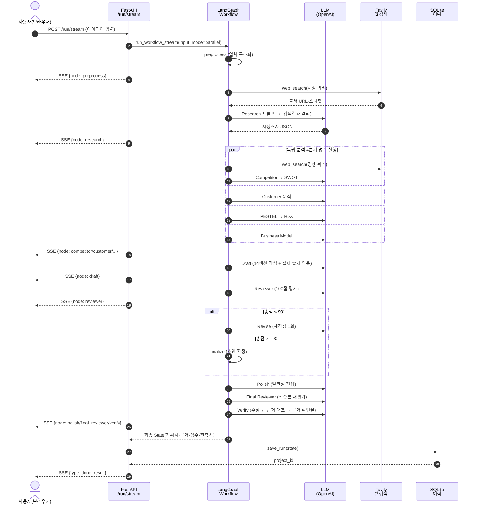
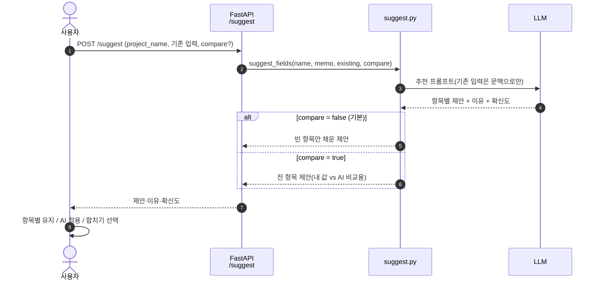
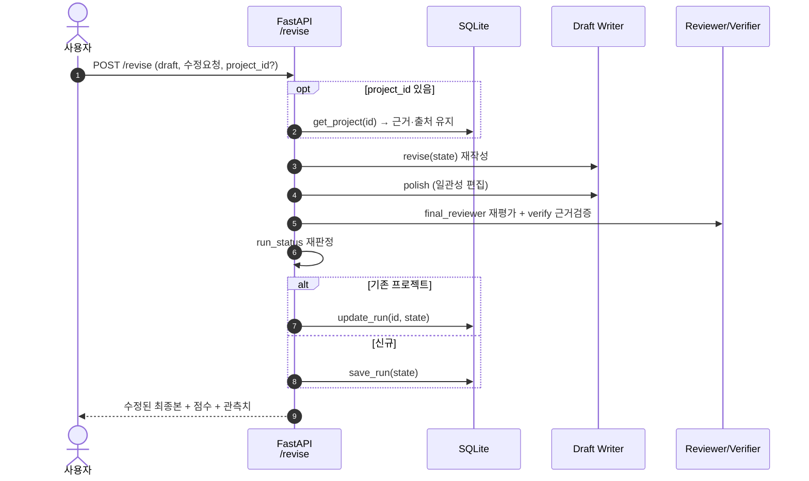

# 04. 시퀀스 다이어그램

> 중간 보고서의 「시스템 설계 — 주요 흐름」 절에 사용. Mermaid ` ```sequenceDiagram ` 블록.

---

## 1. 기획서 생성 (핵심 흐름, `/run/stream` · 병렬 모드)

사용자가 실행하면 SSE로 노드 완료가 실시간 전송되고, 완료 시 결과가 이력에 저장된다.



> **fallback**: 각 노드는 `_safe()` 로 감싸져 있어 LLM/검색 실패 시 예외를 흡수하고 fallback 값으로 진행 → 파이프라인은 항상 완주하며 실패는 `run_status` 로 표면화된다.

---

## 2. 입력 자동완성 (`/suggest`)

빈 항목만 채우고 사용자 입력은 보존한다. 비교 모드는 전 항목에 제안을 생성한다.



---

## 3. 사용자 수정 (Human-in-the-Loop, `/revise`)

수정 요청을 반영해 재작성하고, `/run` 후반부와 동일하게 재처리·재평가한다.


