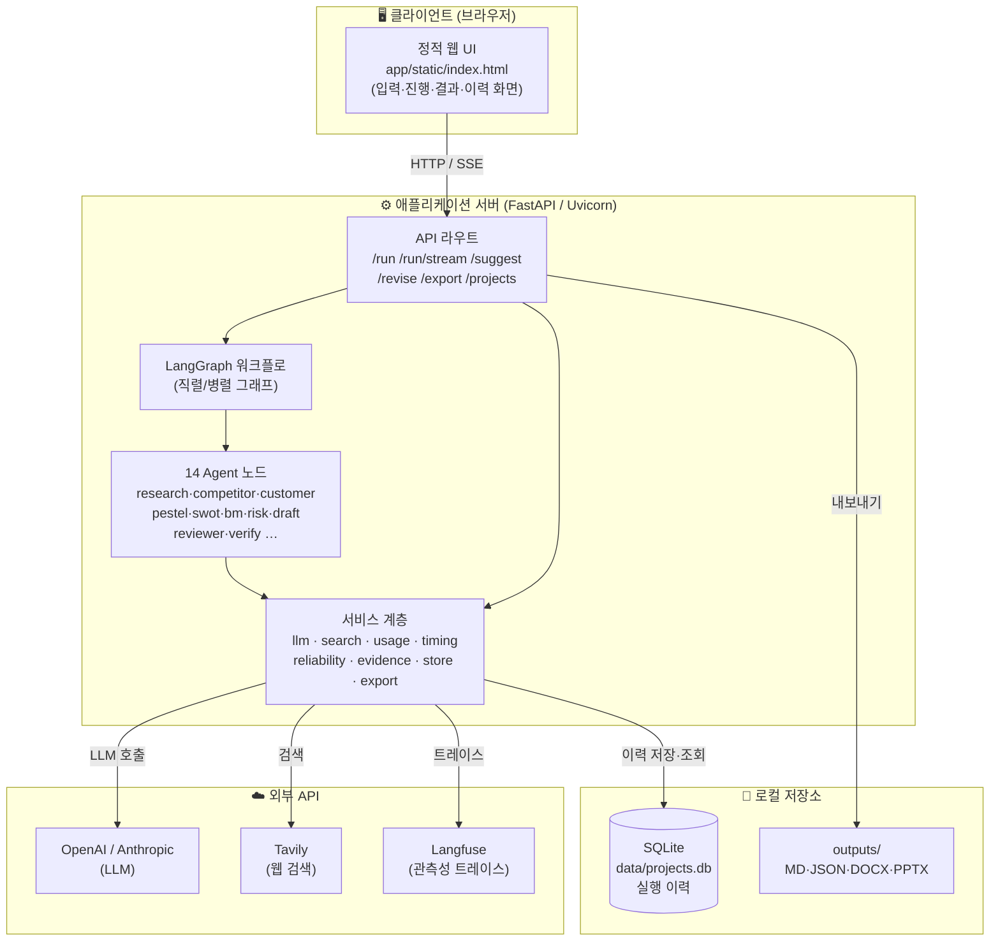
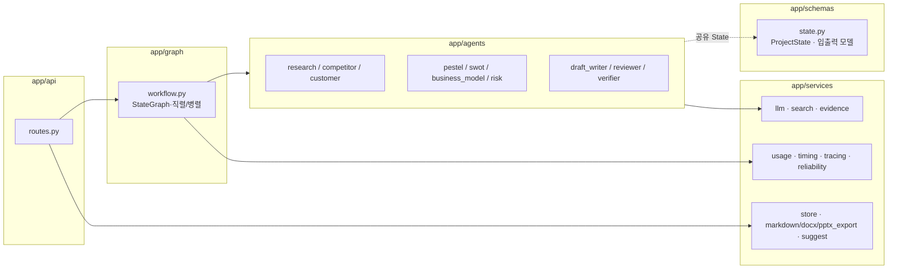

# 05. 배치 다이어그램 · 컴포넌트 구성 · 상태 설계

> 중간 보고서의 「시스템 설계 — 시스템 구성 / 데이터 설계」 절에 사용. Mermaid 블록.

---

## 1. 배치(Deployment) 다이어그램

로컬 실행 기준. FastAPI 단일 프로세스가 UI 서빙·API·워크플로를 담당하고, 외부 LLM/검색/관측 API와 로컬 SQLite에 연결한다.



> **배포 확장(향후)**: 로드맵 Phase 8에서 Docker 이미지화 → Staging/Production CD(빌드→헬스체크→스모크→롤백). 현재는 로컬 `uvicorn app.main:app` 단일 노드.

---

## 2. 컴포넌트(모듈) 구성



---

## 3. 상태(State) 데이터 설계

모든 노드는 단일 `ProjectState`(TypedDict)를 공유한다. 병렬 실행 시 충돌을 막기 위해 일부 필드는 **reducer**(누적 병합)로 선언된다.

| 필드 | 설명 | 비고 |
|---|---|---|
| `user_input` / `structured_input` | 원입력 / 구조화 입력 | |
| `research_result` … `risk_result` | Agent별 분석 산출물 | |
| `competitor_sources` | 경쟁사 검색 출처(구조화) | |
| `evidence_registry` | **통합 근거 레지스트리** (URL·출처Agent·쿼리·evidence_id) | reducer(2-1) |
| `draft` / `final_draft` | 초안 / 최종본 | |
| `review_result` / `final_review_result` | 초안 평가 / 최종본 재평가 | |
| `verification_result` / `verification_summary` | 근거 확인율 / 검증 범위·한계 | 정직성 표기 |
| `logs` / `timing_events` | 실행 로그 / 단계 계측 | **reducer**(병렬 병합) |
| `usage` / `timing` | 토큰·비용·지연 / 단계별 wall·critical path | |
| `run_status` / `failed_nodes` / `fallback_nodes` | 실행 품질 표면화 | |
| `workflow_mode` | serial / parallel | 실험 태깅 |

### 3.1 이력 저장 스키마 (SQLite `projects`)
```
projects(
  id INTEGER PK, project_name TEXT, model TEXT,
  total_score INTEGER, created_at TEXT,
  state_json TEXT   -- 전체 실행 상태(Agent별 산출물·근거·관측치)를 JSON blob으로 저장
)
```

> **설계 메모**: 스키마 버전·마이그레이션은 로드맵 Phase 5(API/State 계약 안정화)에서 도입 예정. 현재는 JSON blob으로 유연성 우선.
